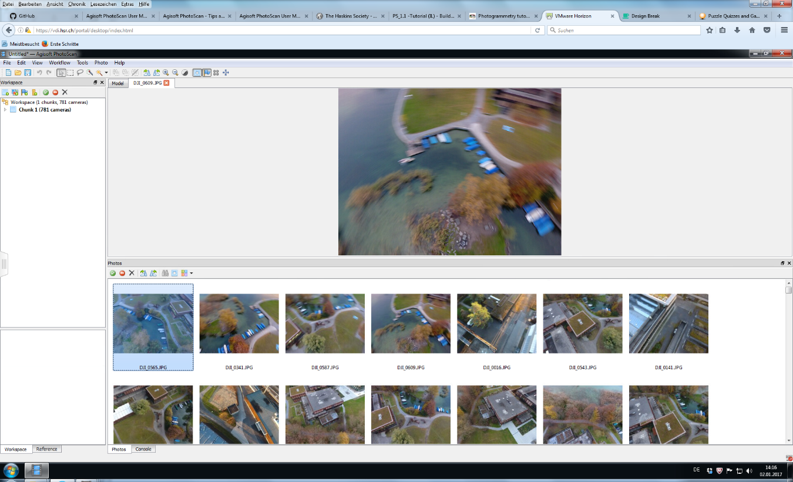
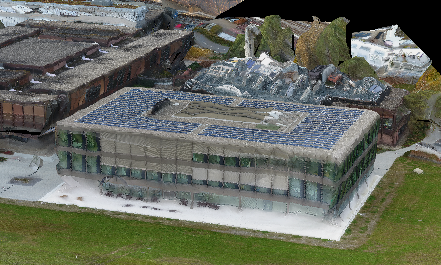
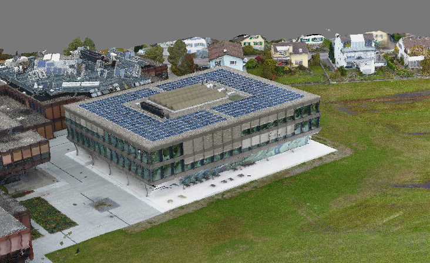
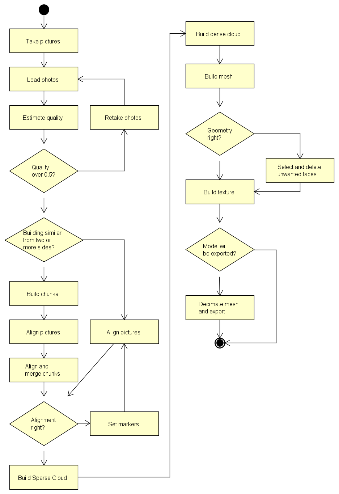

# Workflow of Creating Textured 3D Meshes Using Agisoft PhotoScan and a Reflex Camera (Approach 2a)

Notice: The statements and principles of this chapter are based on the Agisoft
PhotoScan user manual[^1] and conversation with Marianne Deuber from
Terradata[^2].

[^1]: <http://www.agisoft.com/pdf/photoscan-pro_1_2_en.pdf>

[^2]: Sitzungsprotokolle.docx, page 5

## Introduction

To get a photorealistic model generating it from map data and manually texturing
will not suffice. This approach is based on photogrammetry or to be exact on
stereophotogrammetry. By capturing a 3D object in pictures the depth is lost. If
certain points are found on two or more photos the depth can be estimated.

## Requirements

To build a model using photogrammetry certain requirements must be met. You will
need a reflex camera with at least 10 megapixel resolution. Furthermore you will
need the Agisoft PhotoScan software license and a reliable and powerful computer
hardware.

The weather also has a great influence on the outcome. Rain may create
reflections on flat surfaces. Sunny weather may cause reflections in windows.
Optimal weather conditions would be light overcast.

## Tools

### Agisoft PhotoScan

>   Agisoft PhotoScan is a stand-alone software product that performs
>   photogrammetric processing of digital images and generates 3D spatial
>   data.[^3] It is capable of processing up to tens of thousands of photos
>   yielding result products characterized by high degree of accuracy in both
>   the horizontal and vertical dimensions.[^4]

[^3]: <http://www.agisoft.com/>

[^4]: <https://en.wikipedia.org/wiki/PhotoScan>

### Camera

For our evaluation we used a Pentax K20D reflex camera. Basically any reflex
camera with minimum of 10 megapixel resolution. Ideal would be a camera with
geolocation function.

## Workflow

Agisoft PhotoScan guides you quite nicely through the main workflow of
generating the 3D mesh. You basically just have to follow the possible actions
in the registry *Workflow*. But to get the most out of your model you need a
profound knowledge about all the settings.

Here a short estimation of expenditure of time based on a project with 1200
Photos and slightly above average computer hardware:

| Step of the process                        | Expenditure of time |
|--------------------------------------------|---------------------|
| Quality estimation of photos               | 5 minutes           |
| Alignment of the photos                    | 35 hours            |
| Mesh based on sparse cloud                 | 2 minutes           |
| Texturing of the mesh                      | 15 minutes          |
| Build the dense cloud                      | 30 hours            |
| Mesh based on dense cloud                  | 50 minutes          |
| Texturing of the mesh based on dense cloud | 30 minutes          |

### Taking the Pictures

When taking the pictures you must consider some points. First the autofocus
should be turned off. When using a zoom object it is advised to fixate the zoom
after focusing with some tape. While taking the pictures you should always keep
the same distance. Also try to keep the same angle towards the front of the
building. You should aim to achieve an overlapping of 80-90%. Each point on a
picture should be found in at least 4 other pictures. It is better to have too
many than too few pictures. To summarize: aim is to take many sharp pictures
without changing any camera settings.

### Loading and Quality Estimation of Photographs

First of all, you will have to add all the pictures. This can be done in the
registry *Workflow* by clicking on the button *Add Photos* or *Add Folder*. It
is more like a reference to where the photos are located, you only indicate the
photographs that will be used. All selected photos will appear in the photos
work pane.

To detect pictures of bad quality you can estimate the quality of the photos
then right click on a picture and choose *Estimate Image Quality*. Now you can
run the estimation on the chosen picture, all pictures or on the entire
workspace. It takes about five to ten minutes to complete the estimation of a
thousand pictures. To see the results you have to change the view of the photos
work pane to *Details*. If the quality index is under 0.5 it is advised to
remove or retake the photo.

### Masking Items on Images

There may be some unwanted items on the images such as people or shadows or
maybe parts of the building are offset for example a railing. This may influence
the texturing or even the mesh. To prevent this you can set a mask over those
unwanted items. As setting masks is time consuming it is advised to use this
only when needed.

To set a mask use the *rectangle selection* or *intelligent Scissors* to mark
out the unwanted item. In the register *Photo* choose the command *Add
selection.* The mask is now set.

### Chunks and Markers

If the building is similar on two sides, it is wise to set some markers. You
should have at least 4 markers per picture. Less may suffice, but the more the
better the result will be. The markers have to be placed as exact as possible,
so make sure you zoom in properly. If the markers alone are not enough you can
make chunks.

The recommendation from Agisoft PhotoScan is to create a chunk for each side of
the building. You can add chunks by clicking on the *Add chunk* icon in the
workspace. Select a chunk and add all the photos that show a part of for example
the east face of a building as described above. Do the same for the other sides
as well. The alignment of the photos must be done for each chunk separately.
When the pictures are aligned it is possible to align and merge the chunks. For
this select the *Align Chunks…* and then the *Merge Chunks…* command from the
workflow register.

### Alignment of Photos

When all the needed preparation work is done, you can give the command to align
the photos. This can be done by clicking in the workflow register on *Align
Photos…*. Important parameters for the alignment are accuracy, pair
preselection, point limit and the checkbox constrain features by mask.

#### Accuracy

The higher the accuracy is set the more accurate the camera position will be
estimated. But it will also take much longer to fulfil the task. It is
recommended to only use the highest accuracy setting with very sharp image data.

#### Pair Preselection

With a large set of photographs it can take a very long time to process. The
process may be sped up when enabling pair preselection. In **Generic**
preselection mode the overlapping pairs of photos are selected by matching
photos using lower accuracy setting first. If the camera locations have been
measured the **Reference** preselection mode will be enabled. This mode bases
the overlapping pairs of photos on the measured locations.

#### Key Point Limit

As an advanced setting it is possible to set an upper limit of feature points
per image. Setting it to zero value allows the program to find as many key
points as possible. It may also lead to a big number of less reliable points.

#### Tie Point Limit

It is also possible to set an upper limit on the number of matching points for
every image. Using zero value does not apply any limit.

#### Constrain Features by Mask

If you have set some mask on the pictures you can enable *constrain features by
mask*. This way all features detected in the masked areas are discarded.

#### Adaptive Camera Model Fitting

This option enables automatic selection of camera parameters to be included into
adjustment. Especially when modelling buildings this setting helps to adjust
more parameters during initial camera alignment. It will now take quite some
time to generate the sparse point cloud.

>   [./media/image3.png](./media/image3.png)

### Building the Dense Cloud and Mesh

PhotoScan is able to calculate depth information for each camera base on their
positions. It is able to combine these information in a single dense point
cloud. The density of this point cloud is comparable with LIDAR point clouds. To
build the dense cloud select the *Build Dense Cloud* command from the workflow
menu.

#### Quality

Higher quality obtains a more detailed and accurate geometry, but requires
longer time for processing.

#### Depth Filtering Modes

Due to poor texture of some elements or badly focused images there can be some
outliers among the points. PhotoScan offers different filtering algorithms
depending on the project. **Mild** depth filtering mode is recommend if the
geometry of the scene is complex with many details in the foreground. If the
scene does not contain many meaningful details, then it is advised to use the
**Aggressive** filtering mode. **Moderate** depth filtering mode will deliver
results between the Mild and Aggressive approaches. It is also possible to
disable the depth filtering mode, this is not advised.

>   [./media/image5.png](./media/image5.png)

To build the mesh choose the *Build Mesh* command from the *Workflow* menu.
Following parameters can be set:

#### Surface Type

**Arbitrary** surface type can be used for modelling of any kind of objects such
as for example statues and buildings. **Height field** on the other hand
requires less memory and is optimized for modelling of terrains or base reliefs.
Height field is recommended for aerial photography

#### Source Data

**Sparse Cloud** can be used for a fast build which is based solely on the
sparse point cloud. For high quality results use **Dense Cloud** as source data.
This will also result in longer processing Time.

#### Polygon Count

The polygon count specifies the maximum number of polygons in the final mesh.
**High, Medium** or **Low** values are calculated based on the number of points
based in the dense point cloud. The ratio values are 1:5 (High), 1:15 (Medium)
and 1:45 (low). You still can indicate the target number according to your
choice.

#### Interpolation

To achieve an accurate reconstruction interpolation should be **Disabled**. With
interpolation disabled, manual hole filling is required at the post processing
step. With **Enabled** PhotoScan will interpolate some surface areas. This way
some holes will be automatically covered. **Extrapolated** will generate a
holeless model with extrapolated geometry.

>   [./media/image11.png](./media/image11.png)

### Edit Geometry and Texturing the Mesh

Sometimes it is necessary to edit the geometry before building the texture atlas
or exporting the model. Unwanted faces can be removed. First indicate the faces
using the selection tools from the toolbar. Then, to remove the selection use
*Delete Selection* button on the *Toolbar*.

PhotoScan often creates 3D models with excessive geometry resolution. It is
advised to decimate the mesh before exporting. To decimate the mesh select
*Decimate Mesh…* from the *Tools* menu. For PDF export it is recommended to
downsize the number of faces to about 200’000.

If you want to texture the mesh select *Build Texture* command from the
*Workflow* menu. Different parameters can be set:

#### Mapping Mode

This determines how the object texture will be packed in the texture atlas.
**Generic** mapping mode is the default. It allows to parameterize texture atlas
for arbitrary geometry. **Adaptive orthophoto** will split the object surface
into flat part and vertical regions. The flat part is textured use in the
orthographic projection, while vertical regions are textured separately to
maintain accurate texture representation. To allow the whole surface to be
textured in the orthographic projection use **Orthophoto** mapping mode.
**Single photo** mapping mode will use a single photo to generate the texture.
Which photo shall be used can be selected from *Texture from* list. **Keep UV**,
this mode can be used to rebuild texture atlas using different resolution.

#### Blending Mode

**Mosaic** blending mode first bends the low frequency components. High
frequency components (creates the picture details) are taken from one picture.
**Average** uses the weighted average of all the pixel values from each picture.
**Max Intensity** uses the corresponding pixel of picture with the maximum
intensity. **Min Intensity** uses the corresponding pixel of picture with the
minimum intensity. It is possible to **Disable** the blending mode. In this case
the colour value for the pixel is chosen like the one for the high frequency
component in mosaic mode.

#### Texture Size / Count

Texture size / count determines the width and height of the texture atlas (in
pixels) and specifies the number of files for the texture export. Exporting the
texturing to several files archives a greater resolution of the final model
texture.

#### Enable Color Correction

The colour correction process can be useful for data sets with extreme
brightness variation. It takes quite a long processing time. Only use this
feature for data sets that have proved to present results in poor quality.

##### Enable Hole Filling

This parameter helps to avoid a salt-and-pepper effect in case of a complicated
surface with numerous tiny parts of shading. It is recommend to only disable
this function for very specific tasks.

## Flowchart

## Pros and Cons

### Advantages

-   Very realistic

-   Faster to create than OSM with texturing

-   Able to depict any object

### Downsides

-   Tools and equipment costs

-   No roofing

-   Weather-dependent

## Problems

If the building looks similar from different angles, the software seems to have
trouble to distinguish one side from another and cannot align the pictures
properly. To prevent this it is possible to manually set markers. These markers
must be set as exactly as possible.

Another problem are the reflections of windows. One approach is to await perfect
weather conditions. Another approach is to use a polarisation filter on the
camera. The effectiveness of this approach has not been tested.
