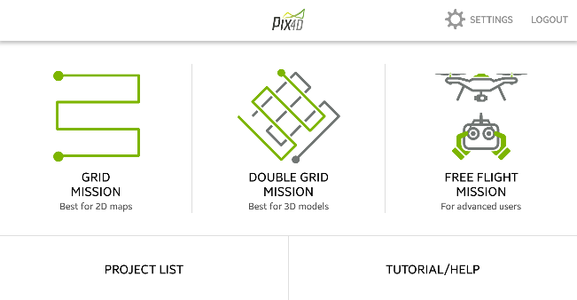
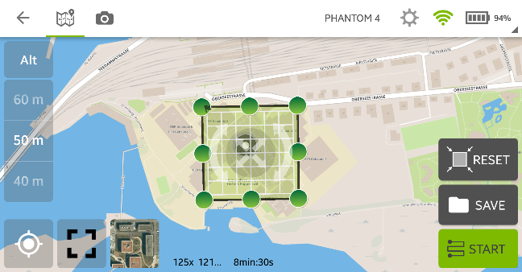
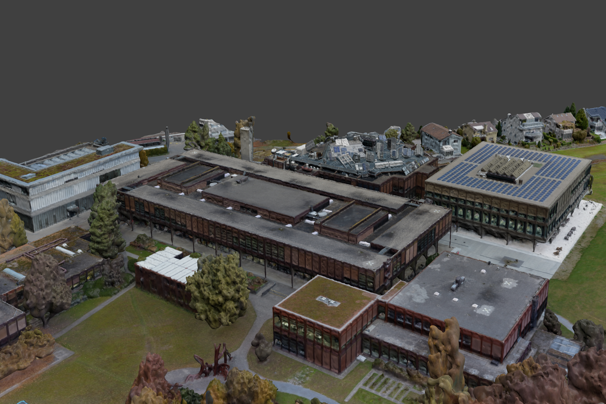

Workflow of Creating Textured 3D Meshes Using Pix4D and a Drone (Approach 2b)
-----------------------------------------------------------------------------

### Introduction

As mentioned above photogrammetry of buildings is limited to the front. To
capture the roof you will even have to learn to fly or find a drone to do that
for you. Together with the Pix4D software it is a quick and easy way to build a
3D model of buildings.

### Requirements

For capturing a three-dimensional object with a drone and Pix4D you will need a
drone that is compatible with Pix4Dcapture[^1]. You will also need a smartphone.

[^1]: <https://pix4d.com/product/pix4dcapture/#compatible-drones>

The weather also has a great influence on the outcome. Rain may create
reflections on flat surfaces. Sunny weather may cause reflections in windows.
Optimal weather conditions would be light overcast.

### Tools

#### Pix4Dmapper

>   Pix4Dmapper automatically converts images taken by drone, by hand, or by
>   plane and delivers highly precise, georeferenced 2D maps and 3D models.
>   They’re customizable, timely, and complement a wide range of applications
>   and software.[^2]

[^2]: <https://pix4d.com/product/pix4dmapper-pro/>

#### Pix4Dcapture

>   Pix4Dcapture turns your consumer drone into a professional mapping tool. A
>   free companion of Pix4D software, Pix4Dcapture allows you to create flight
>   plans for capturing image data.[^3]

[^3]: <https://pix4d.com/product/pix4dcapture/>

#### Drone DJI Phantom 4

>   The DJI Phantom 4 is the smartest flying camera DJI has ever created. Able
>   to fly intelligently with a tap, automatically create seamless tracking
>   shots, fly intelligently over or around obstacles and much more.[^4]

[^4]: <https://store.dji.com/product/phantom-4>

### Workflow

For capturing and generating 3D models with Pix4D and a drone lots of YouTube
tutorials exists. Therefore this will be only a brief walkthrough with focus on
explanations. You will also be led through the whole process by the
applications.

#### Planning a Mission

First of all, you need to plan your flight missions in the Pix4Dcapture app.
Select the double grid mission and position the grid. Make the grid a bit bigger
than the object you want to capture, because the drone takes photos in a 70°
angle. Pay attention to the altitude: if you set it to low, the drone will crash
into trees or buildings.

The preset of the settings is quite well for getting usable photos. If you want
to get even higher quality change the overlap value to 90%, but this will at
least double the flight time.

Pix4Dcapture has an integratet project manager, where you can plan whole
projekts with multiple missions. A benefit is the overview over what you have
already captured.

#### Take Pictures

Important: first clarify the legal situation with regard to privacy and data
protection before flying with a drone.[^5]

[^5]: More information can be found on the webpage of BAZL, see references

Be careful, especially if it is the first time you fly a drone. The drone is not
faultless. Make sure you know how to abort a mission and how to land the drone
manually before you start the mission. If you are unsure, make a test mission on
a big meadow.

If you are happy with the mission and feel comfortable with the drone and the
law, press start and you will be guided till the drone is finished with the
mission.

>   [./media/image5.png](./media/image5.png)

#### Create Pix4Dmapper Project

After taking pictures, you will need to import them into Pix4Dmapper. To do that
copy the pictures to the computer and create a new project in Pix4Dmapper. Give
it a reasonable name and press the *Next*-button.

#### Import Pictures into the Project

Now select the folder containing your pictures or add them individually. If you
want to mix different flight missions, you should make sure that the daytime and
thus the brightness of the object from the flight missions are not too
different. Else you will have displacements or colour spots. Select all pictures
from one mission, or if you made multiple flight missions from the same object
then from all these missions, and change their group to a reasonable name. There
is a simple way how to do that, just click the first image of a mission and then
shift click the last one of this mission. Right click the column *Group* in any
row and press *Edit Groups in Selected Rows*. Now type the name in and click
somewhere else to submit. If you are finished press *Next* twice.

#### Start Processing

You should now be able to choose the processing options template; take 3D models
or 3D models – rapid/low res. Check the *Start Processing Now*-checkbox or
deselect it if you want to change the settings more specifically. Press *Finish*
to continue. In the menu *Process* you will find the processing options. If the
process is not already running you can start it after changing the settings by
pressing the *Start*-button in the processing bar at the bottom of the window.

##### Initial Processing

During the initial process, the images are matched, unsuitable images are
rejected and their exact position is triangulated using key points. This key
points are also called tie points. The image scale setting has a direct
influence to the accuracy of the result.

##### Point Cloud

After the camera positions are fixed, the program will search for pixels that
appear in multiple images. The result is a cloud of points that gives you a
quite detailed view of the resulting mesh. As before you can modify the quality
of the output, but the higher the quality, the longer it takes. A higher point
density will make your 3D model rougher. If you have a building with flat faces
use a lower setting, but if the surface is rough use a higher setting. It is not
suggested to change the **Minimum Number of Matches** except when you have a
high overlay of pictures.

##### Mesh

Pix4Dmapper will use the points from the point cloud to generate the 3D textured
mesh. You can choose in which output type the mesh should be saved. To choose
the quality of the texture is similar to choosing the quality of a picture, if
you need to go close use a high quality, but do not set it higher as needed.
Unreal Engine for example can handle only textures with a maximum of 8192x8192
pixels.

#### Process Finished

Pix4Dmapper will run the whole process without any break and at the end of each
part it will display a detailed report. If the program is finished the output
files are saved in a folder next to the project file.

### Flowchart

>   [./media/image9.png](./media/image9.png)

### Pros and Cons

#### Advantages

-   Very realistic

-   Drone flies autonomous

-   Fast capturing of big areas

-   Simple workflow

-   Area can easily be extended

#### Downsides

-   Cost intensive

-   Good drone needed

-   Difficult to map areas covered by overhanging parts

### Problems

If you want to capture something like a big sculpture, where you need to fly
multiple times in different perspectives, you will have lot difficulties. The
changing sun position and thereby changing light conditions cannot be processed
correctly by Pix4Dmapper.

Some drones will have problems if you fly to fast. The pictures are then
blurred. This can be avoided by setting the drone to fly slowly.
