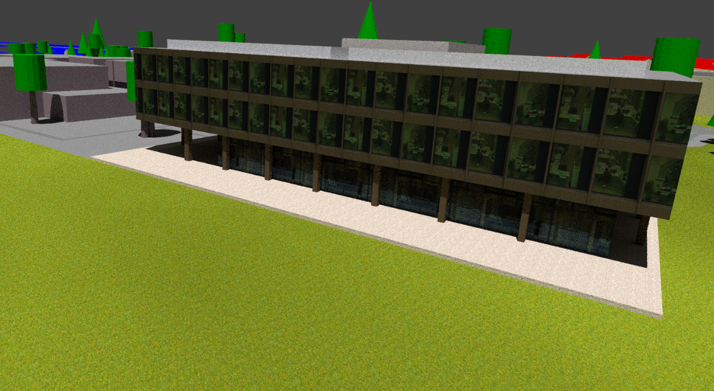
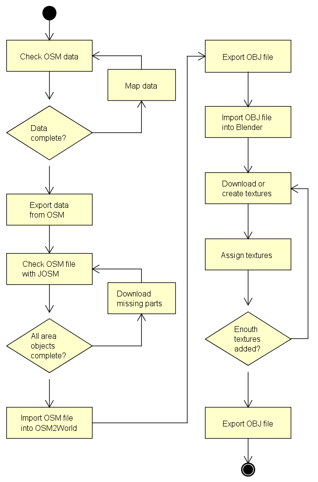

Workflow of Generating a Textured 3D Mesh Based on OpenStreetMap and OSM2World (Approach 1)
-------------------------------------------------------------------------------------------

### Introduction

The idea of this approach is to take open source data and open source software
to generate a 3D model. By mapping the data in OSM you will lose lots of
details, but you will get a 3D model with less bumps and distortions.

### Requirements

The only requirement for generating a textured 3D mesh using OSM data is having
a computer, all software are open source. The time you need to generate a model
depends on how accurate it has to be and on how much data has already been
mapped in OSM.

### Tools

#### OpenStreetMap (OSM)

>   OpenStreetMap is a free, editable map of the whole world that is being built
>   up and extended by volunteers and holds an open-content licence.

>   The OpenStreetMap licence allows free (or almost free) access to OSM images
>   and all of its underlying map data. The project aims to promote new and
>   interesting uses of this data[^1].

[^1]: <https://wiki.openstreetmap.org/wiki/About_OpenStreetMap>

#### OSM2World

>   OSM2World is a converter written that creates three-dimensional models of
>   the world from OSM data. The model can be exported to different formats.[^2]

[^2]: <https://wiki.openstreetmap.org/wiki/OSM2World>

#### Blender

>   Blender is the free and open source 3D creation suite. It supports the
>   entirety of the 3D pipeline-modelling, rigging, animation, simulation,
>   rendering, compositing and motion tracking, even video editing and game
>   creation.[^3]

[^3]: <https://www.blender.org/>

### Workflow

The main tool for generating a 3D model out of OSM data is OSM2World. But this
tool is not as powerful as you would need for well textured 3D models. This
chapter will describe how to use OSM2World and how to extend its abilities.

#### Extend OSM Data

First of all, you will have to search on the OSM webpage for the area you want
to convert to a 3D model. After you found the area, check for missing objects or
details and extend the OSM data with the online tool iD. iD is a html based
editor embedded in the browser. Select the *Edit* register and sign up to edit
the OSM data. There is a tutorial that will introduce you to using iD. There
exist other editors, like JOSM, which have similar, less or even more
capabilities for editing OSM data.

#### Export Data

If the OSM data is as detailed as you want it to be, select the *Export*
register at OSM main page and centre the needed area in the browser window.
Pressing the *Export* button will export everything you see in the browser
window. In the export section there is the possibility to set the export frame
manually. When the frame is set correctly you can export the OSM file and save
it to the computer.

#### Check OSM File with JOSM

The export function of the OSM webpage will export only nodes and ways. Areas,
which are partly outside the export boundaries, will not be exported completely.
OSM2World cannot convert partly downloaded areas and therefore will ignore
these.

To avoid this open the OSM file with JOSM and watch over each entry in the
*Relations*-list at the bottom right corner. Incomplete objects are marked as
incomplete. Right click on the objects you want to complete and choose the
*Download incomplete members* command to download the missing parts. The routes
and other way relations do not have to be complete, as it may not be suggestive
to download whole street networks. Multi-polygons like buildings and other area
relations should be complete.

>   [./media/image1.png](./media/image1.png)

After downloading the missing parts save the changes made to the OSM file, but
do not export them to the OSM database.

#### Convert OSM File with OSM2World to OBJ file

Start the OSM2World java program and open the OSM file using *File* \> *Open OSM
file*. At this state of process you can see what it will look like in 3D but
without textures. It is difficult to navigate in the 3D viewer of OSM2World, so
do not spend too much time there. Use *File* \> *Export OBJ file* to convert the
OSM file to an OBJ File and save it to the computer.

#### Import the OBJ File into Blender

For the next step we will use Blender. If you are not used to Blender, work
through some tutorials[^4] first or try to follow these steps as exactly as
possible. Shortcuts and instructions will be written at the end of the step. Pay
attention to the position of your curser, some shortcuts will apply to the
window you are hovering.

[^4]: We recommend <http://blenderhilfe.de/?product=einfuehrung-in-blender>

-   Open Blender and delete the cube in the main window.

    -   right click the cube to select it “x” enter

-   Open the file browser for importing OBJ files.

    -   Menu *File \> Import \> Wavefront (.obj)*

-   Map the orientation of the OBJ file to *X Forward* and *Y Up*

    -   In the menu on the left located in *Import OBJ*

    -   Forward: X Forward

    -   Up: Y Up

-   Import the OBJ file

    -   Double click the file.

#### Implement Textures

A big advantage of OSM2World is its ability to assign the materials to the 3D
objects. Adding textures to materials is easy. Just repeat the following
instructions for each material and you will have a textured 3D model. Quality of
the result depends on the quality of the chosen texture.

Select an object by right clicking it and go to the *Materials* register in the
*Properties* window. Choose the material you want to add a texture and change to
the *Texture* register.

>   [./media/image3.png](./media/image3.png)

>   [./media/image5.png](./media/image5.png)

Press the *New* button and choose the **Type of texture** you need. There are
some calculated textures like the **cloud** or the **noise texture**, but
normally you will need to import textures as images.

>   [./media/image7.png](./media/image7.png)

>   [./media/image9.png](./media/image9.png)

On the webpage <http://www.textures.com/> you can find lots of textures to
download. To link the texture, press the *Open* button in the section *Image*
and select your texture. Now you need to optimize the mapping of the image. If
you are not used to the mapping methods, use **global** and a projection
depending on the form of your objects.

#### High Quality Textures

To create high quality textures watch the “Blender 3D Einsteiger Training”
tutorial by blenderhilfe.de[^5]. The important part is chapter C, where you can
find information about texturing. You do not have to configure the shading,
because the shading settings will not be exported into OBJ files. Notice, that
Blender is not able to export materials if you use cycles render. Therefore use
always blender render.

[^5]: <http://blenderhilfe.de/?product=einfuehrung-in-blender>

### Flowchart

### Extend OSM2World

As a part of the evaluation, we analysed the tool OSM2World and tried to extend
its functionality. It turned out that it is easier than expected.

#### Source Code

The source code is located at <https://github.com/tordanik/OSM2World> and can
easily be downloaded. There is an ant build file to simplify the build of your
changes. Below a brief description of the project structure

##### console

Contains the commands and functions for using the jar file over the console.

##### viewer

Contains the menu commands and functions to preview the 3D model in the program
window.

##### core.osm

Contains the functions to read OSM data and store them for further processing.

##### core.hightmap

Should contain the functions to read elevation information and store them, but
not yet implemented.

##### core.map\_data

Contains the classes and functions to store the OSM data in a more OSM2World
specific way.

##### core.map\_elevation

Contains the classes to store the elevation information for the map data and the
functions to apply them.

##### core.world

Contains the modules to convert map data objects to a 3D objects. This package
is responsible for handling the tags mapped in OSM.

##### Core.target

Contains the converter methods for the specific targets and the functions to
save them.

#### Extend OSM Tags

Some details you may want to figure in 3D cannot be mapped with tags defined by
OSM wiki. OSM itself is able to carry any tag you want it to, but it is
important, that you get the acceptance of the community before you define a new
tag. This step you do not have to note if you just want to improve the
representation of the objects.

#### From Tag to Object

OSM data are represented as a collection of tags which OSM2World changes to a
vector based 3D representation. Therefore for example a wastebasket will always
look the same. You can either add more property tags to the wastebasket to
define its height, direction, colour or diameter and then extend OSM2World to
handle these tags or you can just change its basic representation.

#### Example: Table

This is a demonstration of how we extended the OSM2World with the ability to
display tables.

On GitHub[^6] you can find the commit containing all changes we made in the
code.

[^6]: <https://github.com/tordanik/OSM2World/commit/187efc06f1a15225cd8bb148c279a9ef7055969f>

##### Define a New Node Tag

As a first step, we defined “amenity=table” as a node tag for tables. It is
important to add these definitions to the OSM wiki with all their property tags.
But first we talked to some members of the community about the advantages and
the details of the idea. Finally we added some tags to the OSM database to be
able to test our code later on.

Here is the resulting wiki page:
<https://wiki.openstreetmap.org/wiki/Tag:amenity%3Dtable>.

There is already a node tag for picnic tables which is not yet implemented in
OSM2World. This allows us to cover two objects with one change.

##### Create a Table Class

The table fits best in the *StreetFurnitureModule*, which is why we created a
new class named *Table*[^7] there. Thanks to other classes like *Bench* we were
able to copy some code snippets. At the top of the java file you can find the
mapping of node tags and the representation class, what also needed to be
completed.

[^7]: Code can be found in the appendix.

##### Result

Finally we built the code and ran it with our OSM test file. Here is what the
results looks like:

>   [./media/image15.png](./media/image15.png)

### Pros and Cons

#### Advantages

-   Each object is separate editable, therefore the mesh can be easily
    manipulated

-   Large wiki website with helpful information exists

-   Very quick if sufficient OSM data present

-   Buildings can be mapped very detailed

-   Low costs

#### Downsides

-   Accuracy cannot be guaranteed

-   Faces are subdivided unnecessarily

-   Calculation mistakes can happen

-   Faces overlap

-   Difficult to achieve a realistic texture

### Problems

Some objects, like underpasses, are wrong implemented in OSM2World and need to
be removed by hand. Sometimes there can be “phantom points” in the OSM file.
These points can lead to mistakes in the model generated by OSM2World which need
to be manually corrected. Next to these we have encountered no other problems
with using OSM, OSM2World or Blender.
